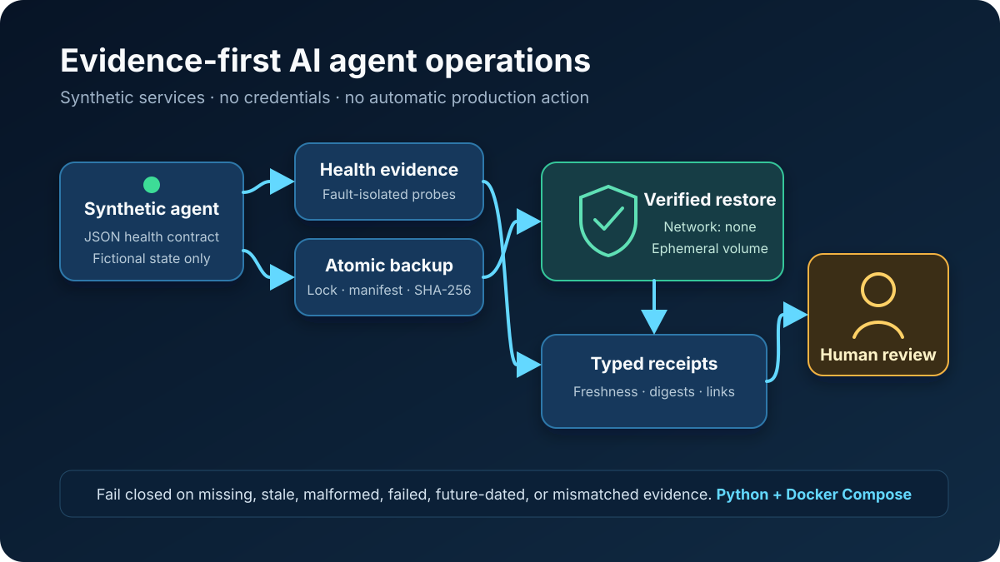

# Reliable AI Agent Ops

A credential-free Python and Docker project that shows how to check an AI
service, create a backup, test the backup in isolation, and require human review
before recovery.



## Review this project in 3 minutes

No setup is required:

1. Follow the diagram from service health through backup and restore testing.
2. Read [How it works](#how-it-works) and
   [Safety and limits](#safety-and-limits).
3. Open the [architecture](docs/architecture.md),
   [demo guide](docs/demo.md), or
   [automated checks](https://github.com/mccruz/reliable-ai-agent-ops/actions/workflows/ci.yml)
   for technical evidence.

## The problem

An AI service is not reliable simply because it can produce an answer. Operators
also need to know whether the service is healthy, whether its state can be
restored, and whether recovery evidence is complete and current.

This project turns those questions into a small, repeatable workflow that ends
with a person—not an automatic production action.

## How it works

1. Check a fictional AI service and record when the check occurred.
2. Create a locked backup with checksums for its files and archive.
3. Introduce a fictional service failure.
4. Restore the backup into temporary storage with networking disabled.
5. Compare every restored file with the backup record.
6. Recheck health and connect the failure, backup, restore, and recovery records.
7. Stop at `ready-for-human-review`.

## What this demonstrates

| Need | Project response |
| --- | --- |
| One service can fail without hiding other results | Check services independently and record clear failure reasons |
| A backup can be incomplete or changed | Lock creation and verify file and archive checksums |
| A restore test must not touch live data | Use temporary storage and disable container networking |
| Old or inconsistent evidence is unsafe | Reject missing, stale, future-dated, or mismatched records |
| Recovery should remain accountable | Require human review instead of automatic remediation |
| Integrations can leak operational detail | Use credential-free notification previews and limited commands |

## Optional Docker demo

The demonstration uses fictional data and local containers. It requires no API
keys, external services, or production access.

```bash
git clone https://github.com/mccruz/reliable-ai-agent-ops.git
cd reliable-ai-agent-ops
export DEMO_UID="$(id -u)"
export DEMO_GID="$(id -g)"
docker compose up --build
```

On Windows with Docker Desktop, run `docker compose up --build` without the two
environment-variable commands. The containers exit when the scenario finishes.

Open `demo-output/summary.json`. A successful run reports that the scenario
passed, human review is required, and automatic recovery was not executed. See
the [demo guide](docs/demo.md) for expected stages, cleanup, and troubleshooting.

## Safety and limits

- All scenario data is fictional, and the repository contains no credentials or
  production configuration.
- Scenario services run as non-root users with restricted container
  capabilities.
- The restore check uses separate temporary storage and no network access.
- Archive extraction rejects unsafe paths, links, unexpected files, and checksum
  mismatches.
- Recovery stops when evidence is missing, outdated, invalid, or inconsistent.
- External commands are allowlisted, run without a shell, and have time limits.
- Notifications are dry-run previews; no chat or incident service is contacted.

The included health checks support HTTP, command, and process probes but do not
cover every production platform. The update check uses a local fictional
manifest, and recovery never restarts a real service. Integrating a production
orchestrator, alerting platform, or secret manager would require a separate
review.

## Verification

The automated suite covers health checks, backup locking and checksums, safe
restore extraction, evidence freshness, recovery decisions, command limits, and
the full Docker scenario.

```bash
python -m unittest discover -s tests -v
python -m compileall -q src tests
```

GitHub Actions repeats the checks across supported Python versions and runs the
complete Docker demonstration.

## Project guide

- [Architecture and safety model](docs/architecture.md)
- [Docker demo](docs/demo.md)
- [Public/private boundary](docs/provenance.md)
- [Security policy](SECURITY.md)
- [Contributing](CONTRIBUTING.md)

## License

Copyright © 2026 Mark Cruz. Released under the [MIT License](LICENSE).
