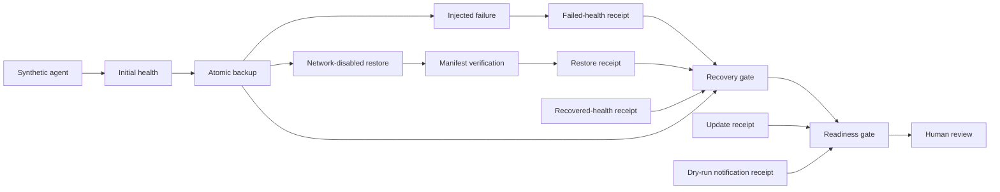

# Architecture and safety model

## Design goal

Reliable AI Agent Ops answers a narrow operational question: **is there fresh, linked evidence that a synthetic AI-agent service failed, its state was recoverable in isolation, and the service later returned healthy?**

The answer is a receipt-backed decision, not a privileged action. The code deliberately stops at `ready-for-human-review`.

## Evidence flow

## Components

### Health checks

`health.py` accepts up to 32 explicit `http` or `https` targets, rejects URLs containing credentials, bounds response size and timeouts, and checks services concurrently. Each future is isolated: a timeout, invalid payload, or unexpected exception becomes one failed result rather than cancelling evidence for the other services.

### Receipts

`receipts.py` defines one versioned envelope for health, backup, restore, update, notification, recovery, and readiness evidence. Timestamps must be timezone-aware. Atomic writes use a same-directory temporary file, `fsync`, restrictive permissions, and `os.replace`.

Freshness checks reject evidence that is:

- missing or malformed;
- older than the configured window;
- dated beyond a small future-clock tolerance;
- the wrong kind or status.

Receipt digests use canonical JSON and SHA-256 so downstream gates can reference exact upstream evidence.

### Demo storage initialization

The Compose demo runs one short-lived root initializer before any scenario
service. It accepts only non-root UID/GID values, requires dedicated container
mounts, rejects overlapping targets, links, and special files, and applies
ownership only after validating every entry. It has no network and receives only
`CHOWN` and `DAC_OVERRIDE`. The four scenario services then run as the invoking
host user with all capabilities dropped, keeping restrictive receipt permissions
while making the synthetic evidence reviewable and removable by that user.

### Backup

`backup.py` acquires a non-blocking exclusive file lock and rejects overlapping source/output directories, symbolic links, and non-regular files. It creates a staged archive containing:

- sanitized relative paths;
- deterministic metadata;
- a manifest with file sizes and SHA-256 digests;
- a separate archive checksum.

The archive and checksum are moved into place atomically. The receipt is written only after successful publication and retention. Retention targets only files created by this package's naming convention.

### Restore verification

`restore.py` first validates the external archive checksum. It then rejects unsafe or ambiguous archive content, including:

- absolute paths and `..` traversal;
- backslashes;
- symbolic links, hard links, devices, and other special files;
- duplicate manifest paths;
- malformed digests and sizes;
- excessive member counts or restored bytes.

Files are extracted into a new temporary target, hashed while streaming, and compared as an exact set against the manifest. A passing receipt requires an explicit network-disabled runtime and records that the target was ephemeral and no live volume was touched.

In the demo, the `restore-verifier` Compose service enforces `network_mode: none`, receives the backup directory read-only, and uses a separate scratch volume.

### Recovery and readiness

`recovery.py` does not execute remediation. It verifies that:

1. the failed-health receipt shows at least one failed service;
2. backup and restore evidence are fresh and checksum-linked;
3. restore isolation is `none` / ephemeral / no live volume;
4. recovered-health evidence shows zero failed services.

The readiness gate then validates every required control and checks that the recovery receipt contains the exact restore and recovered-health receipt digests being presented.

## Trust boundaries

| Boundary | Enforcement |
| --- | --- |
| Health input | Explicit targets, bounded concurrency/time/size, no URL credentials |
| Filesystem input | No path overlap, symlinks, special files, or absolute receipt paths in evidence |
| Archive input | External SHA-256 plus internal exact manifest reconciliation |
| Restore environment | Compose `network_mode: none`, read-only backup mount, separate scratch volume |
| Container runtime | Scenario services run non-root with read-only root filesystems, `no-new-privileges`, and all capabilities dropped; the exited initializer is limited to guarded mount ownership |
| Notification | Dry-run implementation, no credentials, no external delivery |
| External processes | Fixed allowlist, validated identifiers, argv invocation, `shell=False`, timeout |
| Decision output | Fail closed, freshness checked, human review only |

## Failure semantics

Operational checks return explicit failed receipts where failed evidence is itself meaningful, such as the injected health failure. Unsafe configuration or malformed artifacts raise an error and stop the stage. A later gate never treats an exception, missing file, or stale success as a pass.
